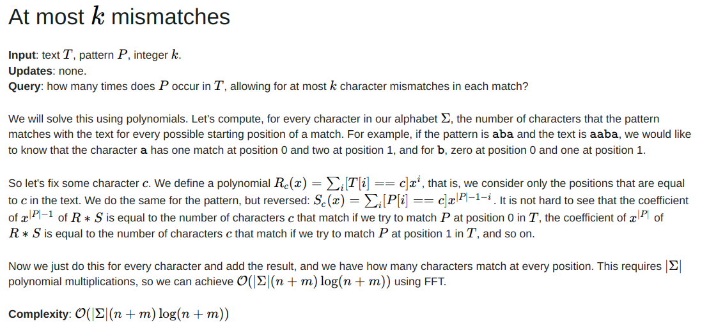

# 1C-selection

<h2> Идея решения </h2>

Рассмотрим содержимое двух файлов - строки. Пусть паттерн - строка, которая имеет меньшую длину, текст - вторая строка.
В качестве функции сходства я решил рассмотреть максимальное число совпадающих символов при всевозможных сдвигах паттерна относительно текста. Данная задача решается при помощи быстрого преобразования Фурье. Подробности можно найти по [ссылке](https://codeforces.com/blog/entry/111380) в разделе "At most k
mismatches":



Предполагается, что бинарный файл задаёт текст с символами из ASCII-таблицы.

<h2> How to build </h2>
Для запуска программы необходимо выполнить следующие команды в корне директории проекта:

```
rm -rf build
mkdir build && cd build
cmake ..
make    
```
В текущей папке build появится исполняемый файл "dir_comparator". Для его запуска выполните следующую инструкцию:
```
./solution <относительный путь до директории 1> <относительный путь до директории 2> <процент>  
```

<h3> Пример запуска программы </h3>

```
rm -rf build
mkdir build && cd build
cmake ..
make
./dir_comparator ../dir_1 ../dir_2 0.5
```

<h3> Пример ответа программы </h3>

```
Identical files:
../dir_1/ergcregcre.txt - ../dir_2/b.txt

Similar files:

Unique files from the first directory:

Unique files from the second directory:
../dir_2/a.txt
```